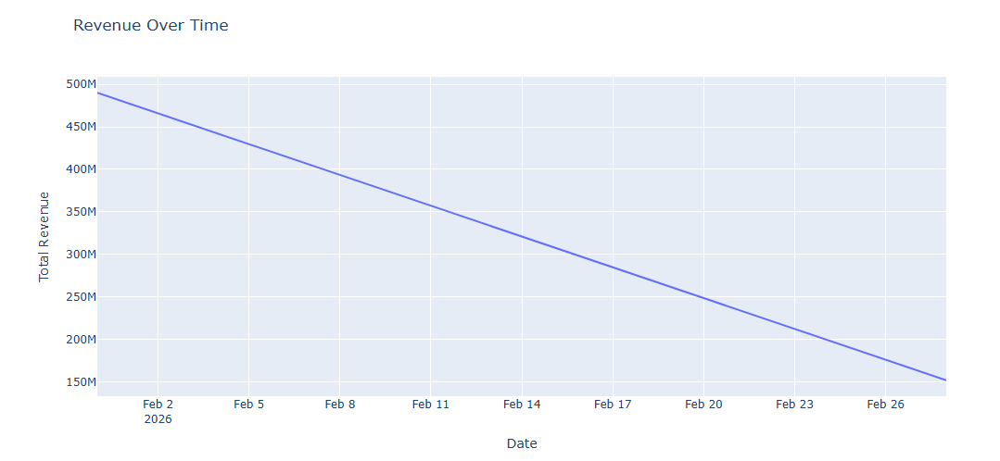
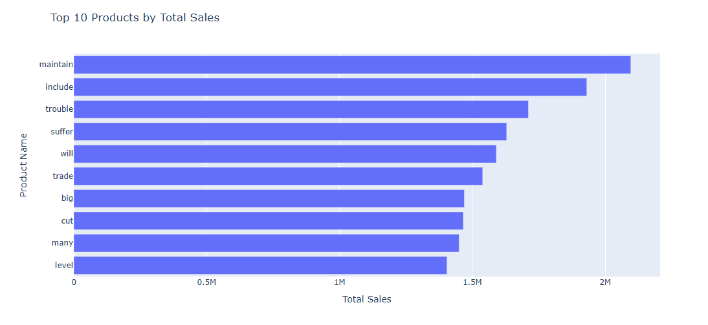
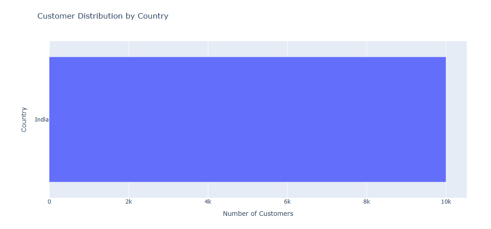

# Amazon_Sales_Analysis
This project involves an analysis of Amazon sales data to visualize key business performance indicators (KPIs) and customer demographics. It covers revenue trends, top-selling products, customer distribution, sales by category and payment method, shipping costs, and the impact of discounts to provide actionable insights for business strategy.
## Dataset
The analysis uses the `amazon_sales_dataset.csv` file, which contains detailed transaction records including order information, customer details, product categories, sales figures, discounts, shipping costs, and payment methods.

## Key Performance Indicators (KPIs) Analyzed:
1.  **Revenue Over Time:** Visualized monthly total revenue to identify sales trends and seasonality.
2.  **Top 10 Products by Sales:** Identified and displayed the top 10 products contributing most to total sales.
3.  **Customer Demographics by Country & State:** Analyzed and visualized the distribution of customers across different countries and states.
4.  **Sales by Product Category:** Explored total sales across various product categories to highlight best-performing segments.
5.  **Sales by Payment Method:** Examined total sales generated through different payment methods.
6.  **Shipping Costs by Payment Method:** Compared total shipping costs associated with various payment methods.
7.  **Relationship Between Discount and Total Sales:** Visualized the correlation between discount percentages and total sales to understand pricing strategies.
8.  **Average Order Value by Payment Method:** Calculated and displayed the average order value for each payment method.
9.  **Shipping Costs by Category:** Compared total shipping costs across different product categories.

## Tools and Libraries Used
-   **Python:** Programming language.
-   **Pandas:** For data manipulation and analysis.
-   **Matplotlib, Seaborn, Plotly Express:** For data visualization.
-   **Google Colab:** For developing and running the Python notebooks.

## How to Run the Project
1.  **Clone the repository:**
    ```bash
    git clone https://github.com/Hadi02-gif/Amazon_Sales_Analysis.git
    cd Amazon_Sales_Analysis
    ```
2.  **Open the notebook:** Upload `amazon_sales_analysis.ipynb` to Google Colab or open it in a Jupyter environment.
3.  **Ensure the dataset is present:** Make sure `amazon_sales_dataset.csv` is in the same directory as the notebook.
4.  **Run the cells:** Execute the cells sequentially in the notebook to reproduce the analysis and visualizations.

## Future Enhancements
-   Further segmentation of customer demographics (e.g., by city, customer ID analysis).
-   In-depth analysis of order status and delivery times.
-   Predictive modeling for sales forecasting or customer churn.

[](https://colab.research.google.com/github/Hadi02-gif/Amazon_Sales_Analysis/blob/main/Visualizing_Business_KPIs.ipynb)

Revenue Over Time:

File Name (after saving): revenue_over_time.png
README.md Link: 
Description: Shows the overall sales trend and any seasonality or significant changes in revenue over the analyzed period.

Top 10 Products by Total Sales:

File Name: top_10_products.png
README.md Link: 
Description: Highlights the best-performing products, indicating which items are driving the most sales.

Customer Distribution by Country (or Top 10 Countries):

File Name: customer_distribution_by_country.png
README.md Link: 
Description: Visualizes where the customer base is geographically concentrated, showing key markets.

Top Categories by Total Sales:

File Name: top_categories_by_sales.png
README.md Link: 
Description: Illustrates which product categories generate the most revenue, useful for inventory and marketing strategies.

Total Sales by Payment Method:

File Name: sales_by_payment_method.png
README.md Link: 
Description: Compares the total sales attributed to each payment method, indicating popular options.

Relationship Between Discount and Total Sales (Scatter Plot):

File Name: discount_vs_sales_scatter.png
README.md Link: 
Description: Explores how different discount levels correlate with total sales, offering insights into pricing strategies.
